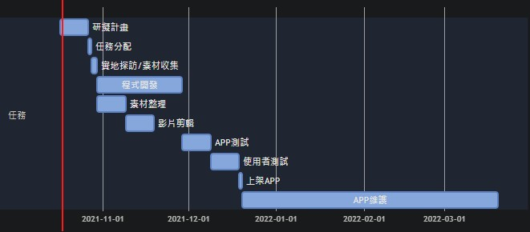
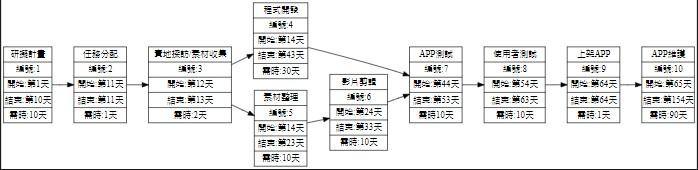
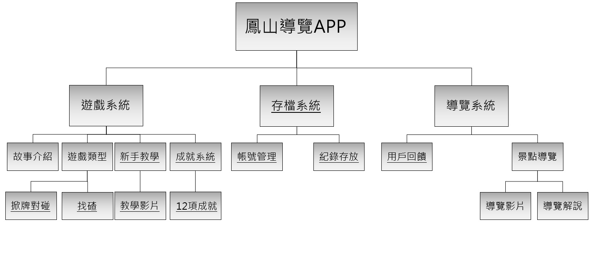
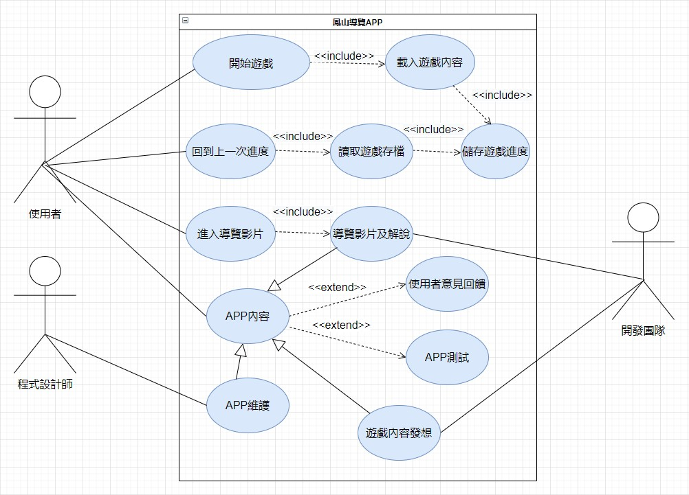

# Team11

## 題目：鳳山導覽APP

### 組員
|學號|姓名|
|:---|:---:|
|C108118105|許志成|
|C108118139|黃柏瑄|
|C108118147|鄭育銓[組長]|

### 任務分配
|任務|姓名|
|:---:|:---:|
|程式開發|許志成|
|實地探訪/素材收集|鄭育銓、黃柏瑄|
|影片配音|鄭育銓、許志成|
|影片剪輯|黃柏瑄|
|APP維護|許志成|

### 內容
藉由互動程式激發使用者進行探索，並以有趣的故事背景以及輕鬆的闖關方式，讓使用者花最少的時間熟悉APP的運作，就能達到地方導覽的目的。 
故事的背景發生在不久的將來，因爲人類對環境的破壞，地球逐漸走向滅亡。而玩家要扮演負責維持全宇宙運行的外星人刑警，你要在鳳山新城裡藉由解讀石碑上的古文獲得情報，並完成任務來取得藏在新城裡的寶物-復原槍,並拯救地球。

---

### 甘特圖

---

### PERT/CPM 圖

 關鍵路徑:1➞2➞3➞4➞7➞8➞9➞10

---

## 需求工程
### 功能性及非功能性需求
功能性需求： 
1.自動存檔：設定存檔點，讓使用者可以隨時記錄，避免操作失誤所造成的不可回逆反應。 
2.遊戲偏好設定：增加音效及遊戲音樂聲音設定，方便使用者隨時調整。 
3.加入導覽影片：利用導覽影片，使用者能藉此快速了解在地文化與地方特色。 
非功能性需求： 
1.維護性：定期進行系統的維護與測試，並將每次的檢查進行事件記錄，對其中發現的問題進行根本原因分析。 
2.穩定性：APP操作流暢，不閃退、卡頓。 
3.易用性：介面簡單易懂，使用者不需花太多時間研究操作。 

---

### 功能分解圖

---

### 需求分析
1.使用者可以藉由APP來了解鳳山歷史與現況 
2.使用者可以藉由導覽影片來了解鳳山歷史及文物 
3.程式設計師對APP進行維護 
4.假設提供意見與回饋，系統必須記錄下來 
5.使用者在進入遊戲前，會先了解操作方式 
6.使用者進入APP時，可選擇體驗完整遊戲內容或觀看導覽影片 
7.使用者進入APP時及進入遊戲後，可以進入設定調整音樂及音效聲量 
8.使用者進入遊戲後可隨時設定存檔點 
9.開發團隊對遊戲內容進行發想及拍攝導覽影片

---

### 使用案例圖

---
